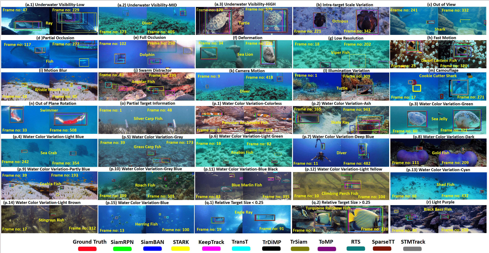
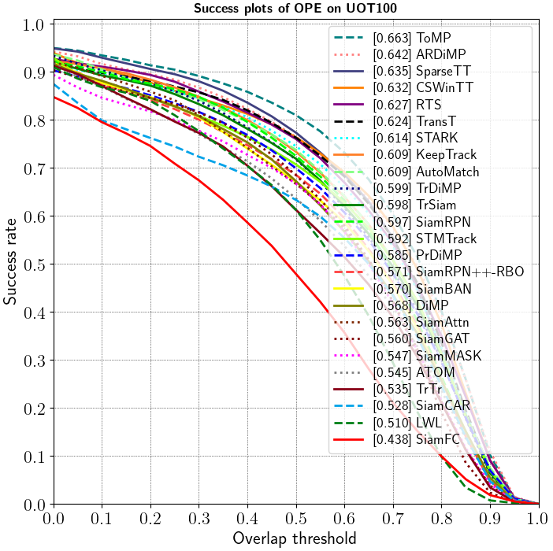
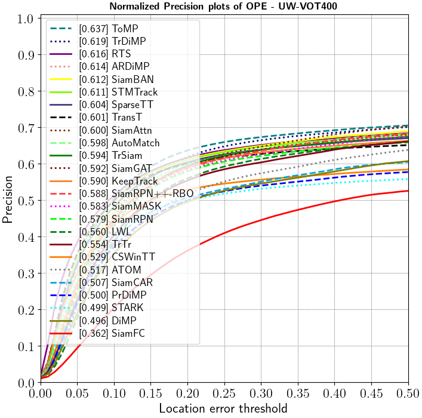
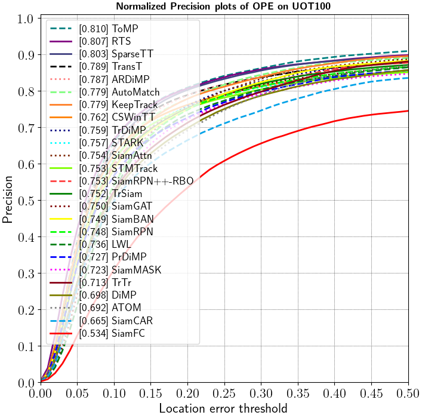
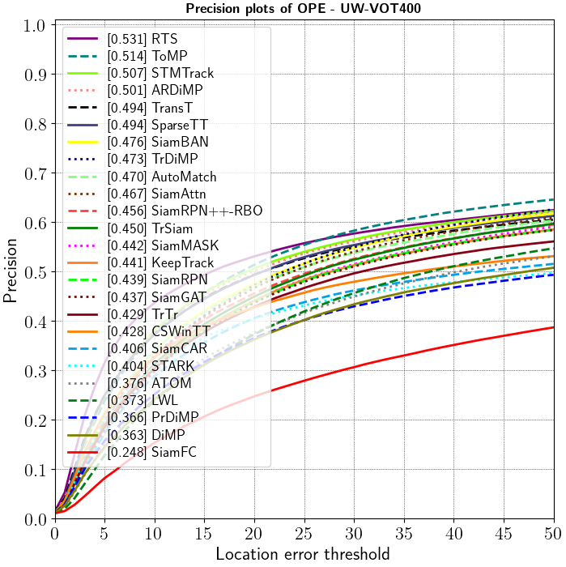
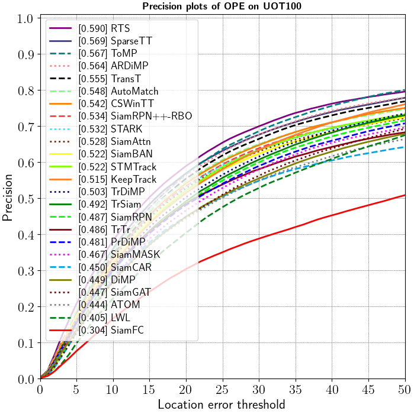

# Protocol 1: Benchmark Pre-trained Open-air Trackers on UW-VOT400

In this experiment, we benchmark SOTA trackers on our dataset (UW-VOT400) and compare the performance with the UOT100 dataset. 



Datasets:
 1. UW-VOT400: Downlad the training set and test set from [here](README.md/#links-to-datasets) and merge them together in single folder.
 2. UOT100: Download the dataset from [here](README.md/#links-to-datasets).

Metrics: 
 1. Success (Succ),
 2. Precision (Prec), and 
 3. the normalized precision (N-Prec)

## Results

<table>
  <tr>
    <th></th>
    <th></th>
    <th colspan="3" style="text-align: center;">UW-VOT400</th>
    <th colspan="3" style="text-align: center;">UOT100</th>
  </tr>
  <tr>
    <th></th>
    <th>Tracker</th>
    <th>Success</th>
    <th>Norm Precision</th>
    <th>Precision</th>
    <th>Success</th>
    <th>Norm Precision</th>
    <th>Precision</th>
    
  </tr>
  <tr>
    <th>1</th>
    <td>RTS</td>
    <td>0.547</td>
    <td>0.616</td>
    <td>0.531</td>
    <td>0.627</td>
    <td>0.807</td>
    <td>0.590</td>
  </tr>
  <tr>
    <th>2</th>
    <td>ToMP</td>
    <td>0.539</td>
    <td>0.637</td>
    <td>0.514</td>
    <td>0.663</td>
    <td>0.810</td>
    <td>0.567</td>
  </tr>
  <tr>
    <th>3</th>
    <td>ARDiMP</td>
    <td>0.527</td>
    <td>0.614</td>
    <td>0.501</td>
    <td>0.642</td>
    <td>0.787</td>
    <td>0.564</td>
  </tr>
  <tr>
    <th>4</th>
    <td>STMtrack</td>
    <td>0.525</td>
    <td>0.611</td>
    <td>0.507</td>
    <td>0.592</td>
    <td>0.753</td>
    <td>0.522</td>
  </tr>
  <tr>
    <th>5</th>
    <td>TrDiMP</td>
    <td>0.522</td>
    <td>0.619</td>
    <td>0.473</td>
    <td>0.599</td>
    <td>0.759</td>
    <td>0.503</td>
  </tr>
  <tr>
    <th>6</th>
    <td>SparseTT</td>
    <td>0.518</td>
    <td>0.604</td>
    <td>0.494</td>
    <td>0.635</td>
    <td>0.803</td>
    <td>0.569</td>
  </tr>
  <tr>
    <th>7</th>
    <td>TransT</td>
    <td>0.514</td>
    <td>0.601</td>
    <td>0.494</td>
    <td>0.624</td>
    <td>0.789</td>
    <td>0.555</td>
  </tr>
  <tr>
    <th>8</th>
    <td>TrSiam</td>
    <td>0.503</td>
    <td>0.594</td>
    <td>0.450</td>
    <td>0.598</td>
    <td>0.752</td>
    <td>0.492</td>
  </tr>
  <tr>
    <th>9</th>
    <td>SiamBAN</td>
    <td>0.498</td>
    <td>0.612</td>
    <td>0.476</td>
    <td>0.570</td>
    <td>0.749</td>
    <td>0.522</td>
  </tr>
  <tr>
    <th>10</th>
    <td>KeepTrack</td>
    <td>0.494</td>
    <td>0.590</td>
    <td>0.441</td>
    <td>0.609</td>
    <td>0.779</td>
    <td>0.515</td>
  </tr>
  <tr>
    <th>11</th>
    <td>AutoMatch</td>
    <td>0.486</td>
    <td>0.598</td>
    <td>0.470</td>
    <td>0.609</td>
    <td>0.779</td>
    <td>0.548</td>
  </tr>
  <tr>
    <th>12</th>
    <td>SiamAttn</td>
    <td>0.486</td>
    <td>0.600</td>
    <td>0.467</td>
    <td>0.563</td>
    <td>0.754</td>
    <td>0.528</td>
  </tr>
  <tr>
    <th>13</th>
    <td>SiamRPN++-RBO</td>
    <td>0.479</td>
    <td>0.588</td>
    <td>0.456</td>
    <td>0.571</td>
    <td>0.753</td>
    <td>0.534</td>
  </tr>
  <tr>
    <th>14</th>
    <td>SiamRPN</td>
    <td>0.475</td>
    <td>0.579</td>
    <td>0.439</td>
    <td>0.597</td>
    <td>0.748</td>
    <td>0.487</td>
  </tr>
  <tr>
    <th>15</th>
    <td>SiamGAT</td>
    <td>0.469</td>
    <td>0.592</td>
    <td>0.437</td>
    <td>0.560</td>
    <td>0.750</td>
    <td>0.447</td>
  </tr>
  <tr>
    <th>16</th>
    <td>SiamMASK</td>
    <td>0.467</td>
    <td>0.583</td>
    <td>0.442</td>
    <td>0.547</td>
    <td>0.723</td>
    <td>0.467</td>
  </tr>
  <tr>
    <th>17</th>
    <td>CSWinTT</td>
    <td>0.463</td>
    <td>0.529</td>
    <td>0.428</td>
    <td>0.632</td>
    <td>0.762</td>
    <td>0.542</td>
  </tr>
  <tr>
    <th>18</th>
    <td>LWL</td>
    <td>0.457</td>
    <td>0.560</td>
    <td>0.373</td>
    <td>0.510</td>
    <td>0.736</td>
    <td>0.405</td>
  </tr>
  <tr>
    <th>19</th>
    <td>TrTr</td>
    <td>0.452</td>
    <td>0.554</td>
    <td>0.429</td>
    <td>0.535</td>
    <td>0.713</td>
    <td>0.486</td>
  </tr>
  <tr>
    <th>20</th>
    <td>STARK</td>
    <td>0.434</td>
    <td>0.499</td>
    <td>0.404</td>
    <td>0.614</td>
    <td>0.757</td>
    <td>0.532</td>
  </tr>
  <tr>
    <th>21</th>
    <td>ATOM</td>
    <td>0.433</td>
    <td>0.517</td>
    <td>0.376</td>
    <td>0.545</td>
    <td>0.692</td>
    <td>0.444</td>
  </tr>
  <tr>
    <th>22</th>
    <td>DiMP</td>
    <td>0.421</td>
    <td>0.496</td>
    <td>0.363</td>
    <td>0.568</td>
    <td>0.698</td>
    <td>0.449</td>
  </tr>
  <tr>
    <th>23</th>
    <td>PrDiMP</td>
    <td>0.420</td>
    <td>0.500</td>
    <td>0.366</td>
    <td>0.585</td>
    <td>0.727</td>
    <td>0.481</td>
  </tr>
  <tr>
    <th>24</th>
    <td>SiamCAR</td>
    <td>0.416</td>
    <td>0.507</td>
    <td>0.406</td>
    <td>0.528</td>
    <td>0.665</td>
    <td>0.450</td>
  </tr>
  <tr>
    <th>25</th>
    <td>SiamFC</td>
    <td>0.296</td>
    <td>0.362</td>
    <td>0.248</td>
    <td>0.438</td>
    <td>0.534</td>
    <td>0.304</td>
  </tr>
</table>

| UW-VOT400  | UOT100 |
| :---: | :---:|
|  |   |
|   |   |
| |  |


## Reproducing Our Results

1. For each dataset, we have provided the tracking bounding box of each tracker on each video. This can be found in the [tracker_results](tracker_results/) folder. 

2. We have performed all experiments using Microsoft Visual Studio Code editor. 

3. Open [main_eval.py](main_eval.py) file in your favourite editor. 

4. Using the created environment, run the file.

```bash
python main_eval.py
```

NOTE: This will make use of the trackers results files we have provided to generate the above table and plots. 

## Downloading Pre-trained trackers models

We have provided the link to download the pre-trained tracker models utilized in this work below.

[Link to Pre-trained Models](https://kuacae-my.sharepoint.com/:f:/g/personal/100060517_ku_ac_ae/EiEaxX6XgplLtXsPv95PURUBSNODK-irvo46Jks38-OmjA?e=bF3X59)

1. Check the tracker folder name from the link above.
2. Navigate to trained_tracker folder.
3. Create another folder with the same folder name.
4. Download the tracker pre-trained model from the link above and put it in the created folder.

NOTE: The models provided in the link above were gotten from the respective tracker repositories.

## Running the Pretrained Trackers on Custom Videos

If you would like to run the trackers on our dataset videos or your own videos, you will need to do the following:

1. In progress....


## Attribute-wise Performance Evaluation

1. In progress....