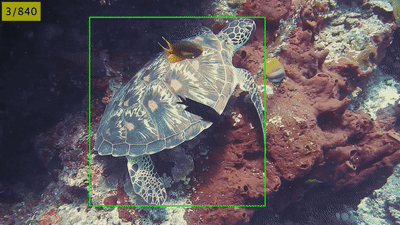
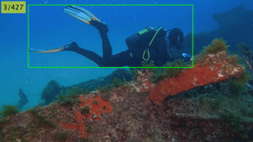

# Improving Underwater Visual Tracking With a Large Scale Dataset and Image Enhancement

 - This repository is the official implementation of our work on **Improving Underwater Visual Tracking With a Large Scale Dataset and Image Enhancement**.

 <p align="center">
<a href="https://arxiv.org/abs/2308.15816"></a>
<a href="./README.md/#our-dataset-uvot400"></a>
<a href="https://drive.google.com/drive/folders/1CVXIOe3C-lp6036dq9QPtjIPuVyOieOZ?usp=sharing"></a>
<a href="https://eval.ai/web/challenges/challenge-page/2268"></a>
</p>

<p align="center">
<a href="./1_Custom_Benchmarking_README.md"></a>
<a href="./README.md/#citation"></a>
</p>

<table align="center" border="0">
  <tr>
    <th><div align="center">
  
  <p>Turtle.</p>
</div></th>
    <th><div align="center">
  
  <p>Diver.</p>
</div></th>
  </tr>
</table>


## Major Updates:
- Nov. 22, 2025: Full test set annotation now available for ease of testing.
- Apr. 22, 2024: UVOT400 evaluation server goes live [see here](README.md/#uvot400-evaluation-server).
  
<details>
  <summary>Show more updates</summary>
 
- Nov. 16, 2023: Added two more trackers (ARTrack, MAT)[here](1_Custom_Benchmarking_README.md).
- Oct. 19, 2023: Added two more trackers (SLT-Track and DropTrack).
- Oct. 16, 2023: Added three more trackers (MixFormer, MixFormerV2, and AiATrack).
- Oct. 12, 2023: Added two new trackers (SimTrack and GRM).
- Oct. 05, 2023: Quickly Benchmark SOTA trackers on your custom videos. 
- Aug. 31, 2023: ArXiv Link to paper provided.
- Aug. 07, 2023: Repository made public.
- June 30, 2023: Dataset (Train and Test Set link available)

</details>

## Our Main Paper Contributions

1. A large and diverse high-quality UVOT400 benchmark dataset is presented, consisting of 400 sequences and 275,000 manually annotated bounding-box frames, introducing 17 distinct tracking attributes with diverse underwater creatures as targets.

2. A large-scale benchmarking of 24 recent SOTA trackers is performed on the proposed dataset, adopting established performance metrics.

3. An UWIE-TR algorithm is introduced. It improves the UVOT performance of SOTA open-air trackers on underwater sequences.

4. The selected SOTA trackers are re-trained on the enhanced version of the proposed dataset resulting in significant performance improvement across all compared trackers.

## Our Dataset: UVOT400

Details about the data collection, annotations, domain-specific tracking attributes can be found in [our paper](https://arxiv.org/abs/2308.15816).

### Links to Datasets

1. Our UVOT400 dataset:
   - Train Set: [Download link](https://drive.google.com/drive/folders/1iwba0GB4tlGLvGYiY4UmqwpqMrk4ATZz?usp=sharing) 
   - Test Set (First frame annotation only): [Download link](https://drive.google.com/drive/folders/1YVga5qXsD1rT3Wf5tz7asm3nlJCOklE6?usp=sharing)
   - Test Set (Full): [Download link](https://drive.google.com/drive/folders/1EFvO-jGuwe_FyxUiA5QxvrVMA7-F3TKe?usp=sharing)
   - Attributes file: [Download link](https://docs.google.com/spreadsheets/d/1W3TEXnMwq2kC5ypeqIuwJc532c8hXVNS/edit?usp=sharing&ouid=107844401918710795180&rtpof=true&sd=true)

  NOTE: You may use our [evaluation server](https://eval.ai/web/challenges/challenge-page/2268) to evaluate your tracker results.
  
2. Our Previous UTB180 Dataset: [Kaggle Link](https://www.kaggle.com/dataset/21f6e3008c9ac0f51479b93fe0bb0b015469d70153f8987d9f2c3bb3eebbba99).


### UVOT400 Evaluation Server

To evaluate your tracker on our dataset, please click <a href="https://eval.ai/web/challenges/challenge-page/2268" target='blank'>here</a>. 

NOTE: Both train and test split evaluations are available.


## Evaluated Trackers

We have utilized several SOTA trackers for the several experiments we have performed. Links to the github repositories of the trackers are as below (click on the tracker name to go to the github page):

1. Discriminative Correlation Filter-based Trackers:
   - [ATOM](https://github.com/visionml/pytracking), [DiMP](https://github.com/visionml/pytracking), [KYS](https://github.com/visionml/pytracking), [PrDiMP](https://github.com/visionml/pytracking), [ARDiMP](https://github.com/MasterBin-IIAU/AlphaRefine)
2. Deep Siamese Trackers
   - [SiamFC](https://github.com/got-10k/siamfc), [SiamRPN](https://github.com/STVIR/pysot), [SiamMask](https://github.com/STVIR/pysot), [SiamCAR](https://github.com/ohhhyeahhh/SiamCAR), [SiamBAN](https://github.com/hqucv/siamban), [SiamGAT](https://github.com/ohhhyeahhh/SiamGAT), [SiamAttn](https://github.com/msight-tech/research-siamattn), [RBO-SiamRPN++](https://github.com/sansanfree/RBO), , [KeepTrack](https://github.com/visionml/pytracking)
3. Transformer-driven Trackers
   - [TrSiam](https://github.com/594422814/TransformerTrack), [TrDiMP](https://github.com/594422814/TransformerTrack), [STMTrack](https://github.com/fzh0917/STMTrack), [TrTr](https://github.com/tongtybj/TrTr), [TransT](https://github.com/chenxin-dlut/TransT), [Stark](https://github.com/researchmm/Stark), [ToMP](https://github.com/visionml/pytracking), [RTS](https://github.com/visionml/pytracking), [CSWinTT](https://github.com/SkyeSong38/CSWinTT), [SparseTT](https://github.com/fzh0917/SparseTT), [AutoMatch](https://github.com/JudasDie/SOTS)

For our work, we have pulled the trackers from their respective github repositories.

## Experiment Environment Setup

1. Create the python environment

```bash
conda create -y --name uvot400 python==3.7.16
conda activate uvot400  
``` 

2. Install pytorch and torchvision
```bash
pip install torch==1.10.0+cu111 torchvision==0.11.0+cu111 torchaudio==0.10.0 -f https://download.pytorch.org/whl/torch_stable.html
```

3. Install other packages

```bash
pip install -r requirements.txt
```

4. Build region (for [Pysot](https://github.com/STVIR/pysot) library)
```bash
python setup.py build_ext --inplace
```

## Experiments

For our experiments, we have utilized the success, precision, and normalized precision VOT tracker evaluation metrics. For comparison with GOT10k open-air dataset, the average overlap (AO), success rate 0.50, and 0.75 are utilized.

1. [Protocol I: Benchmarking Pre-trained trackers on UVOT400](1_Benchmarking_README.md)

2. [Protocol II: Finetuning and re-benchmarking](2_Finetuning_Benchmarking.MD)

3. [Protocol III: Image enhancement before tracking](3_Enhanced_Benchmarking_README.md)


## Benchmarking SOTA Trackers on Custom Videos

 - This repository also allows you to quickly benchmark SOTA trackers on your custom videos [see here](1_Custom_Benchmarking_README.md). 


## Aknowledgements

- Thanks to the authors of the trackers for providing the implementations.
- Thanks to the [Pysot](https://github.com/STVIR/pysot) and [Pytracking](https://github.com/visionml/pytracking) libraries for providing the tracking evaluation codes.
- We aknowledge the use of [eval.ai](https://eval.ai/) for creating the evaluation server.
- This work acknowledges the support provided by the Khalifa University of Science and Technology under Faculty Start-Up grants FSU-2022-003 Award No. 8474000401.

## Citation

If you find our work useful for your research, please consider citing:

```bibtex
@article{Alawode2026_uvot1900,
title = {Underwater visual tracking with a large scale dataset and image enhancement},
author = {Basit Alawode and Sajid Javed and Fayaz Ali Dharejo and Mehnaz Ummar and Arif Mahmoud and Fahad Shahbaz Khan and Jiri Matas}
journal = {Neurocomputing},
pages = {132586},
year = {2026},
issn = {0925-2312},
doi = {https://doi.org/10.1016/j.neucom.2025.132586},
url = {https://www.sciencedirect.com/science/article/pii/S0925231225032588},
}

@article{Alawode2023,
archivePrefix = {arXiv},
arxivId = {2308.15816},
author = {Alawode, Basit and Dharejo, Fayaz Ali and Ummar, Mehnaz and Guo, Yuhang and Mahmood, Arif and Werghi, Naoufel and Khan, Fahad Shahbaz and Matas, Jiri and Javed, Sajid},
eprint = {2308.15816},
title = {{Improving Underwater Visual Tracking With a Large Scale Dataset and Image Enhancement}},
url = {http://arxiv.org/abs/2308.15816},
volume = {14},
year = {2023}
}

@inproceedings{alawode2022utb180,
  title={UTB180: A High-quality Benchmark for Underwater Tracking},
  author={Alawode, Basit and Guo, Yuhang and Ummar, Mehnaz and Werghi, Naoufel and Dias, Jorge and Mian, Ajmal and Javed, Sajid},
  booktitle={{ACCV}},
  year={2022}
}
```
- [x] Benchmarking trackers on custom videos [here](1_Custom_Benchmarking_README.md)
- [x] Provide dataset thumbnails [here](https://kuacae-my.sharepoint.com/:f:/g/personal/100060517_ku_ac_ae/EoF4-F76hNhFqvxJfomF6YoBw0Dz5mRYubL9KpoWs6gAkw?e=hzKfxp).
- [x] UVOT400 dataset evaluation server [here](README.md/#uvot400-evaluation-server).
- [ ] Attribute-wise evaluation results [here](1_Benchmarking_README.md/#attribute-wise-performance-evaluation)
- [ ] Fine-tuned trackers benchmarking results
- [ ] Enhanced frames trackers benchmarking results
